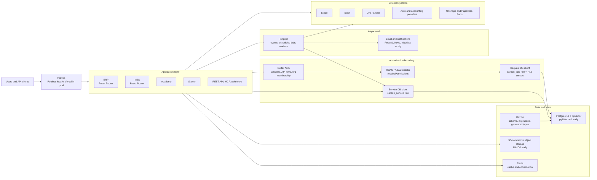

# Architecture

Carbon is now organized around a clean Postgres-first runtime. The platform uses Better Auth to establish user, organization, and role context, Drizzle to own schema and migrations, and request-scoped database clients to keep app reads and writes bound to the authenticated tenant.



## Runtime Principles

- Postgres 18 with pgvector is the source of truth. Local Docker uses `pgvector/pgvector:pg18-trixie`.
- Drizzle owns schema definition, migrations, generated types, and greenfield database initialization.
- Better Auth owns identities, sessions, API keys, organization membership, and permission checks.
- The normal request path uses `carbon_app` with RLS context derived from `requirePermissions`.
- `carbon_service` is a narrow privileged boundary for trusted jobs, signed webhooks, bootstrap flows, and other server-only workflows after explicit scope validation.
- S3-compatible storage replaces Supabase storage. MinIO is the local implementation.
- Polling and route revalidation replace Supabase realtime subscriptions.

## Greenfield Local Setup

The dev CLI is designed for clean setup and reset flows:

```bash
pnpm install
pnpm dev
```

`pnpm dev` runs `crbn up`, which starts the per-worktree Docker stack, applies database migrations, validates schema types, and starts the selected apps behind portless.

For a clean local reset, use:

```bash
crbn reset
crbn up
```

The expected local database containers are `pgvector/pgvector:pg18-trixie` with PostgreSQL 18 and pgvector installed.
